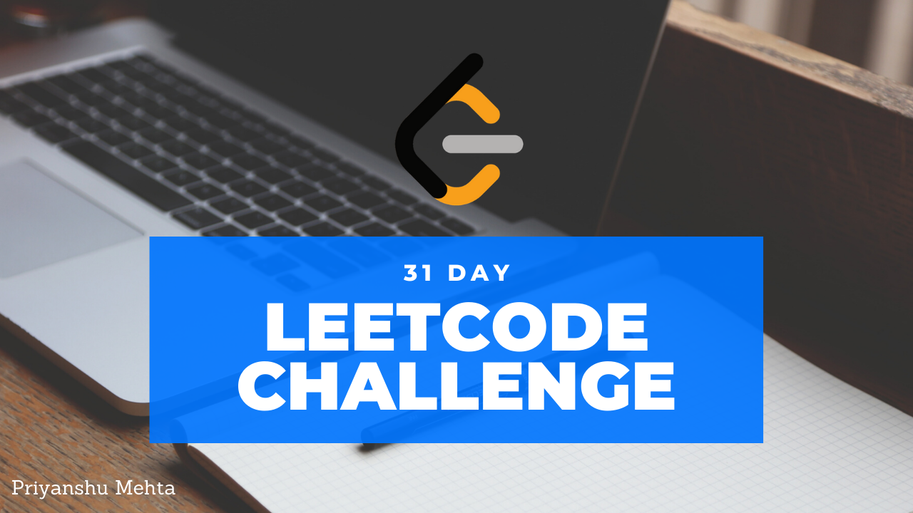

# LeetcodeMayChallenge2020
The 31 day leetcode challenge! One day , one problem! #leetcode #challenge

Below I'll be listing the daily problems along with the core concept the problem is based on along with any difficulty that I faced while solving the problem in the following format!

### Day n : Problem Title --> Concept & Difficulty --> Link to Explanation

Day 1 : First Bad Version --> Binary Search --> https://bit.ly/3bWEYvX  
Day 2 : Jewels and Stones --> Brute Force (Space Time Trade off) --> https://bit.ly/35pcLeG  
Day 3 : Ransom Note --> Frquency Map --> https://bit.ly/2YuigaO  
Day 4 : Number Complement --> Bit Manipulation --> https://bit.ly/2W2EZcn  
Day 5 : First Unique Character in String --> Frequency Map --> https://bit.ly/2yvwMUT  
Day 6 : Majority Element --> Boyer-Moore Voting Algorithm --> https://bit.ly/2WaFLUF  
Day 7 : Cousins in Binary Tree --> Tree Traversal --> https://bit.ly/2YFkXGm  
Day 8 : Check if a Straight Line --> Mathematics --> https://bit.ly/3cdrBYo  
Day 9 : Valid Perfect Square --> Binary Search / Mathematics --> https://bit.ly/3clRe9I  
Day 10 : Find the Town Judge --> Graph Indegree Outdegree --> https://bit.ly/2WjLuYv  
Day 11 : Flood Fill --> Recursion --> https://bit.ly/3clcvA8  
Day 12 : Single Element in Sorted Array --> Binary Search --> https://bit.ly/2WmYsVi  
Day 13 : Remove K digits --> String Builder & Stack --> https://bit.ly/3bnFhPm  
Day 14 : Trie (Prefix Tree) --> Trie Data Structure Implementation --> https://bit.ly/2yUOUI9  
Day 15 : Max Sum Circular Subarray --> Kadane's (Got stuck with corner case) --> https://bit.ly/3dOYETe  
Day 16 : Odd Even Linked List --> Linked List --> https://bit.ly/3dRKjW8  
Day 17 : Find All Anagrams in a String --> Sliding Window (Bringing down Time complexity) -->https://bit.ly/2Ttwfuf  
Day 18 : Permutation in String --> Sliding Window (Optimization) --> https://bit.ly/2LBFlAr  
Day 19 : Stock Spanner --> Stack and Data Structure Design --> https://bit.ly/36hUPDh  

